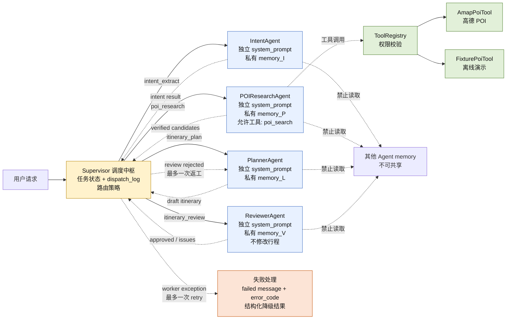

# TravelMind 多智能体架构与验收图

这张图对应当前可运行的 `app/multi_agent_core` 实验三核心。实线是控制流，蓝色虚线是结构化数据流，绿色虚线是工具调用，红色虚线是失败/重试路径。每个 Worker 内的 memory 只归该 Worker 实例所有。



## 当前检查结果

| 检查项 | 结果 | 证据 |
| --- | --- | --- |
| 实际打印各 Agent memory | 通过 | `demo_run.py` 现在打印 counts 和完整内容 |
| Supervisor 按路由逻辑分发 | 通过 | `route_after()`；Reviewer 失败会回 Planner 一次 |
| 不同 Agent 工具权限不混用 | 通过 | `ToolRegistry` + `allowed_tools={"poi_search"}`；有越权测试 |
| Agent 失败重试/降级 | 通过 | `max_attempts=2`；失败返回 `status=failed`、`error_code` 和调度日志 |
| 私有 memory 隔离 | 通过（实验核心） | 每个 Agent 实例独立 `private_memory`；测试验证对象不是同一实例 |
| 网页主链路私有 memory | 尚未完全迁移 | 主 FloatTrip LangGraph 仍共享 `TravelPlanState`，见下方边界说明 |

## 现场演示命令

```powershell
cd "C:\Users\31071\Desktop\暑期4+\Trip_Agent"
.\.venv\Scripts\python.exe -m app.multi_agent_core.demo_run --offline --city Beijing --request "Plan a relaxed cultural day trip"
```

检查输出中的四个部分：

1. `[dispatch]`：Supervisor 发给哪个 Agent、任务类型和 attempt；
2. `[result]`：Agent 返回结果；
3. `PRIVATE MEMORY CONTENTS`：四个 Agent 的记忆内容不同；
4. `dispatch_log`：结构化消息、返工或失败记录。

## 必须如实说明的边界

本图是实验三核心的真实架构，不应声称网页主旅行链路已经完全切换到该 Supervisor。网页主链路仍是共享 `TravelPlanState` 的 LangGraph 工作流；当前已具备 Planner/Reviewer 条件回路、RAG、工具调用和候选池扩展，但还没有把每个网页节点全部改造成带私有 memory 的 Worker 实例。
