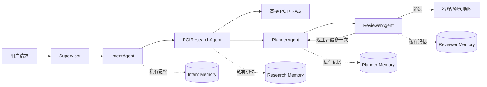

# 实验2交付物：概要设计与详细设计

## 1. 总体架构图



## 2. Agent 设计卡

| Agent | 目标与能力边界 | 工具 | 记忆范围 |
|---|---|---|---|
| Supervisor | 只负责任务分发、重试、条件路由；不生成旅游内容 | 无业务工具 | 任务日志，不读取 Worker 私有记忆 |
| IntentAgent | 提取目的地、日期、偏好；不检索 POI | LLM | 私有：意图抽取问答 |
| POIResearchAgent | 检索/核验 POI；不排时间表 | `poi_search` | 私有：检索任务和工具结果 |
| PlannerAgent | 仅使用候选池生成草案；不直接调用 POI 工具 | LLM | 私有：草案与返工上下文 |
| ReviewerAgent | 审核候选池一致性与行程完整性；不改写草案 | LLM | 私有：审核意见 |

## 3. 消息结构

```json
{
  "task_id": "trip-uuid",
  "session_id": "session-uuid",
  "task_type": "itinerary_plan",
  "from": "supervisor",
  "to": "planner_agent",
  "content": {"intent": {}, "candidates": []},
  "status": "running",
  "attempt": 0,
  "trace_id": "trace-uuid"
}
```

`task_type` 表示任务语义；`from/to` 表示消息方向；`content` 只携带下游需要的数据；`status` 取 running/done/failed；`attempt` 用于有限重试；`trace_id` 用于串联日志。

## 4. 记忆隔离表

| 记忆项 | 归属 | 共享方式 | 说明 |
|---|---|---|---|
| 用户原始请求 | Supervisor 任务消息 | 只读传入 | 下游按需获得字段，不共享完整 messages |
| 意图抽取历史 | IntentAgent | 私有 | 不提供给 Planner 的私有上下文 |
| POI 工具结果 | POIResearchAgent | 结构化候选池 | 只将候选 POI 发送给 Planner |
| 草案/返工历史 | PlannerAgent | 与 Reviewer 的结构化消息 | 不暴露其他 Agent 私有记忆 |
| 审核意见 | ReviewerAgent | 结构化返工指令 | 只反馈需要修正的事实 |
